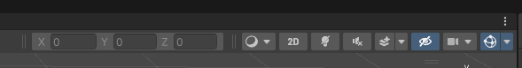
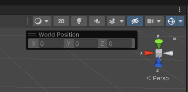
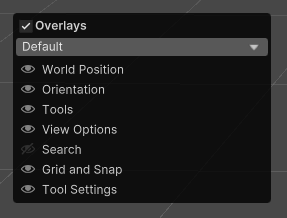

## BlockyWorldEditor
Code from "Creating a 3D Tilemap Editor and World Builder in Unity" [YouTube videos](https://youtu.be/ZxWkhdcHD-4)

### [Quick Start Video](https://www.youtube.com/watch?v=G-SbNFa2RvU&t=2s)

## Installation

Requires Unity 2021.2+
Can be installed via the Package Manager > Add Package From Git URL...
`https://github.com/peartreegames/blocky-world-editor.git`

## Overview

The BlockyWorldEditor allows you to quickly place GameObjects into your scenes on a 1x1x1 unit grid. (Size is potentially modifiable and something which could be added to this package.)

To start click `Tools > BlockyEditor`

## Architectural Overview

### Palettes

`Create > Blocky > Palette`

A collection of IBlockyPieces to place in your scene. Will automatically be added to the dropdown selection.

### Layers

`Create > Blocky > Layer`

A composite key for the placement of IBlockyPieces. Layers can be anything you like, but typical layers may include something like `Terrain`, `Props`, `Water`, etc. Essentially groupings where only one GameObject of that layer type can occupy the same space.

### BlockyObject

MonoBehaviour to be added to GameObjects you wish you place.

### BlockyRuleSet

Collection of BlockyObjects which change based on their neighbours. Good for paths, fences, walls, etc.

### BlockyRandomizer

Collection of BlockyObjects which will choose one at random. Good for landscaping or rubbish, essentially fast placement of inconsequential items strewn about a level to add texture.

### BlockyParentSetter

To create your own ParentSetter create a new class derived from the BlockyParentSetter, which will return a Transform. This allows you to place your objects however you wish. See the [BlockyWorldStreamer](https://github.com/peartreegames/blocky-world-streamer/) for an example.

### IBlockyScenePreprocessor

When finishing painting it's convenient (and advised) to process a scene for optimizations or data collection. Any class which implements this interface will be called for all opened scenes when the mode changes.

    void ProcessScene(BlockyEditorWindow window, Scene scene);
    void RevertScene(BlockyEditorWindow window, Scene scene);

## Hotkeys

| Key | Description |
| --- | --- |
| W/S | Grid Height |
| Shift | Box drag |
| Ctrl | Remove |
| Q/E | Rotate 90 degress |
| R | Random Rotation |
| 1-4 | Brush Size |
| +/- | Increase/Decrease Brush Size |

## Inspector Selection

Hold `ctrl` when selecting an item from the palette to display it in the inspector.

## Notes

BlockyObjects have a "allowRandomRotation" flag, when using RandomRotation in the editor only those set will be rotated, otherwise will be set to the current rotation (or BlockyParentSetter's rotation).

## Undo/Redo

A "Use Undo/Redo" toggle is now available in Edit > Preferences > Blocky Editor

I've decided to keep it out of the regular settings in the Editor Window since it is a User Preference rather than a Placement Setting.

Using Undo/Redo support may cause the placements to lag a bit when square dragging very large areas

## World Position Toolbar

There was a bug with the custom `TransformEditor` that was brought to my attention (Thank you Rev!), 
I've removed it entirely and replaced it with a dockable toolbar [Overlay](https://docs.unity3d.com/Manual/overlays.html).

It can be enabled or disabled from the Overlay menu by pressing Space while focused on the SceneView

## Todo
  - [x] Implement random rotation
  - [x] Implement placement visualization
  - [ ] Better refresh (editor/palettes) on changes
  - [x] Undo/Redo support